1. Auction name is clearly visible 
2. Zippang hammer is visible and clickable(Navigates to the home page)
3. All the sections like (Home, Preview, Auctions, My page, Invoices (invoice dropdowns), Support) are clearly visible and clickable
4. Language is changing successfully by clicking Globe icon
5. **At  notifications search button is not working at preview page**

6. **At notifications pop-up sorting pop up position changes when user selects the sorting options**

7. **Notifications are displayed even when no sorting option is selected.**

8. **On clicking on "Show all notification" button opens notification page which is not responsive and working (Static) and some minor visual bugs**
 

9. The notifications have been successfully marked as read and deleted. 
10. on user profile user's paddle number, username, email and Manage accounts button is clearly visible and working 
11. Logout button functionality is also working 
12. Search functionality is working fine
13. Manual select and select all function is working as expected
14. Product count is working good
15. **At preview page "My page" button is not functioning**

16. NR functionality is working without any issue and black border is also appear when enabled
17. Excel file with product details is downloading by clicking on download/export button 
18. Bulk bid functionality (Watchlist, Pre-bid, reset and cancel bid) are working
19. List view and grip view is working as expected
20. **There is Rap off alignment issue**

21. **Rap off sorting does not adhere to the correct ascending or descending order, which is already a problem.**
22. Batch products count is visible on preview page
23. The filter is operating flawlessly, and all of the filters are appropriate and reset. 
24. Non Reserve ribbons are visible on NR products
25. 0's increment is also clearly mentioned on preview page
26. Starting price is visible in USD and JPY (whose proffered currency is in JPY)
27. S No and certificates are also mentioned 
28. On clicking on certificate it is opening in new window of a browser
29. Remarks is present in products either in the text form or in link form
30. Zoom functionality is working on product detail page on those product who has images
31. Starting price and Amount **(Starting price * Carat)** is clearly visible with dollar and yen prices(Those who has selected preferred currency yen)
32. on setting a pre-bid we can see the bid amount in blue box
33. On product detail page we can share the product with other users by tapping on share button (Branch.io service) is also working 
34. Auction name is clearly returned at product detail page
35. All Product details are correct and clearly mentioned on product detail page
36. The big question mark (Inquiry) button is working and clearly visible and file count is working as expected.
37. Notes is also working as expected and the text is also visible during live auction.
38. Navigation button which helps to navigate to next product present at auction detail page is working
39. For Bulk products there are another navigation arrows which is perfectly working navigating to child products
40. **After clicking at same page again the infinite loading loop triggers**  

41. After clicking on another page is successfully navigates user to the next page
42. Previous and Next also navigates user to next page or previous page based on the current page
43. At Parcel product user can see the table like format which specifies how many pieces and ct product has
44. On right clicking opens the pop-up of Details, by clicking it user can navigate to product detail page of a particular product (On present in Grid view)
45. A GIF present at short break is working and the time is also present 
46. **If we place the pre-bid and watchlist on more than 4 products than we able to see an arrow which helps user to see all the products, the arrows are not fully visible**

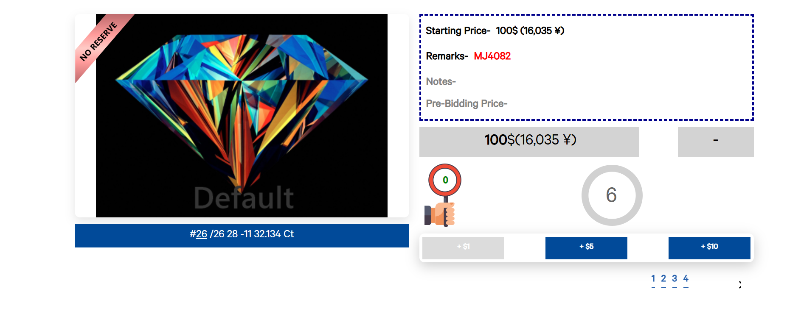

47. **After the product gone than also the product S.no in visible**

48. **Bid Paddle number users see there paddle number not fit properly**

49. **After the the end of the product Thank you box is shrink in size**

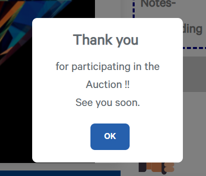

50. **This is an generic issue that the font and alignment is disturbed at many places**
51. **After clicking at Register -> Login button the all the sign-in/sign-up operation comes at right side**
52. **At auction detail page yen prices can be seen when entering the pre-bid but $ price is missing (It should be like setting pre-bid at preview page)

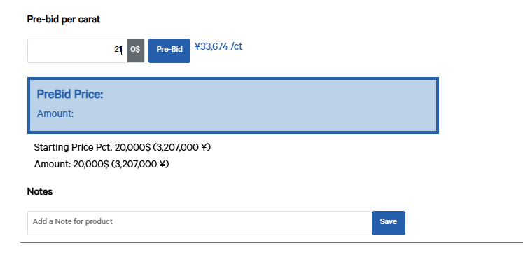

53. **The short break "Auction will resume after the product number", the product number is not present in the message**

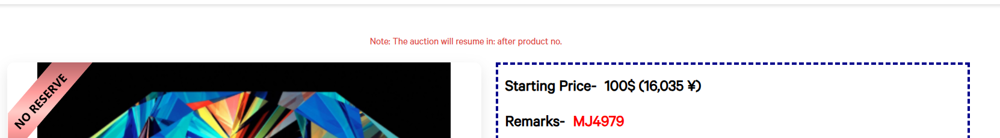

54. **After the auction ends than user automatically navigated to Auctions page (User should be present at Preview page only with past auctions list).**

## Testing on Android web (Chrome)

1. The Hammer icon is visible and on tapping navigate to root location(Login page)
2. **At the first banner the Download auction app is not properly aligned  

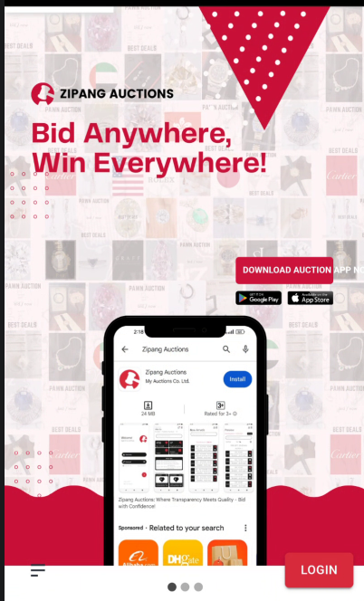

3. Registered button is working as expected which contains all the fields like - First name, Last name, Company, Email, Occupation, Address, Country, State, City, Phone, Preferred language and terms and conditions.
4. Register user functionality is working fine as well
5. **Hamburger opens the three options for user Buy, Upcoming Auctions and Sell but there alignment problem and Menu is not visible

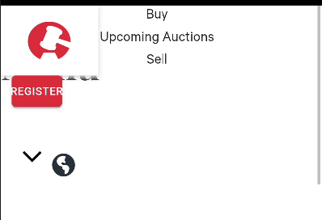

6. ** At IOS after login from Safari browser the landing page was not home page, it looks like this 

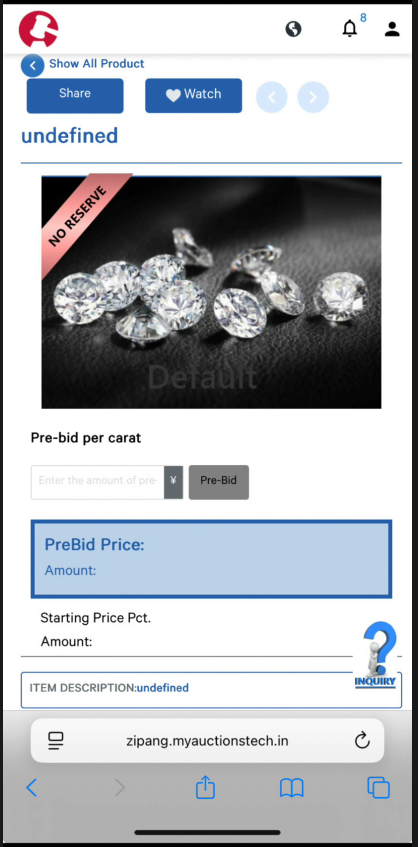

7. After logging in, the user can clearly see the auction name and its status in both browsers. However, in iOS Safari, due to the smaller screen size, the auction timer moves to the next line. When the timer value becomes shorter, it moves back to its original position, causing the auction page to twitch/jump.

	

8. Search element in both the browsers work correctly(We can search the products by S.no and remarks)
9. My page is opening by clicking on my page button at preview page in both the browsers
10. Select all functioning is selects 10 products at a time at both the browsers and can deselect too.
11. NR button is also functioning, all the NR products appear and non NR disappear when enable NR button 
12. Bulk-bid button shows the validation message when none of the product is selected
13. **On My-page if user Select sell/Buy the border appears which should not be present**   

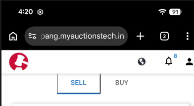

14. User can place the pre-bid and watchlist the product without any issue at preview page(until and unless user is on guest mode or seller of that particular product)
15. **Rap off is not properly aligned at preview page**

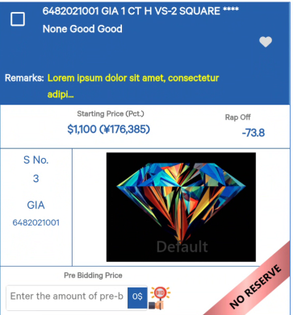

16. Filter of parcel and Diamond is working perfectly without any issue
17. Notes in both the browsers are working and visible at product detail page
18. Starting price and amount (Starting price * Carat) is present at the product detail page
19. Pre-bid after placing we can see it on product detail page in blue box in dollars and yen (Based on the preferred currency)
20. Navigation arrow is visible to navigate to next/Previous product and they are working as expected
21. If the product present in bunch than also other type of navigation arrow present which helps to navigate to child product
22. Navigation form one page to another like Home -> Preview user can do that by tapping on Hammer icon.
23. From the globe icon User can change the language from any page (English, Japanese and Chinese)
24. **Notification has the issues like New and search is not tapable, On tapping All notification some Notifications type of the notification are going out of the box and Select Start date and Select end date placeholders are not working

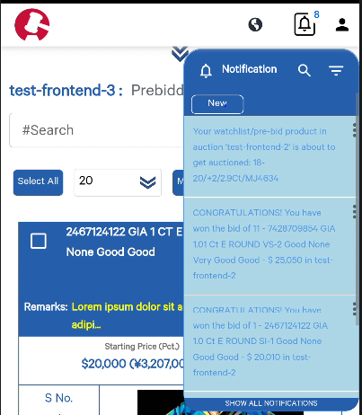

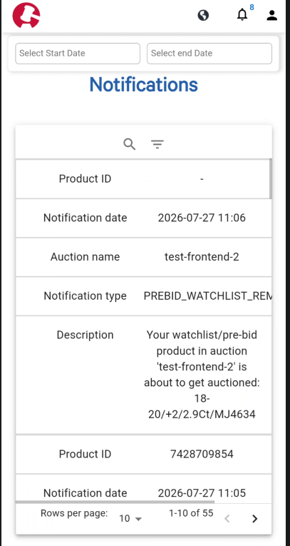

25. NR ribbons are present to the product whose Selling price and starting price is same 
26. Remarks are present either in text or in link
27. **Images and videos can be seen and zoom at product detail page but it is very wired**

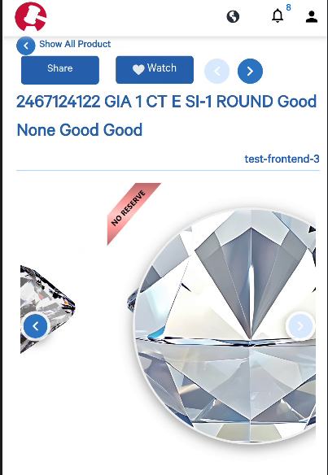

28. **After auction ends in IOS device it logouts automatically** 
29. **Arrows at the time of live auction was not fully visible** 
30. **The paddle number is not fitted in the paddle box** . 